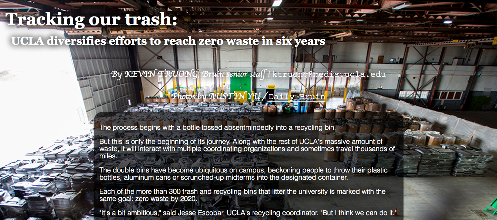

dailybruin-recycling
====================

#todo

* add in graphics
* pretty fonts!
* <del> add in all text (pending completed article) </del>
* <del> add in GitHub link </del>
* <del> add in credit for Jenny, Fred, & Lowell </del>
* <del> blurred rounded rectangle between the text and the backround, but only behind the text (not covering the entire background) </del>
* <del> center the text! </del>
* <del> fix tiling issue </del>
* <del> add in all photos </del>
* <del> move CSS, JS to separate files </del>
